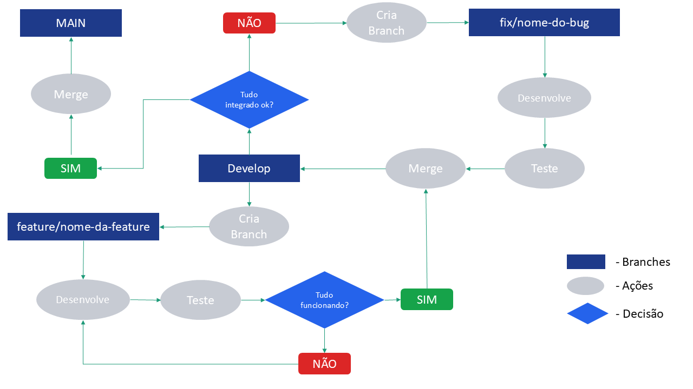

# 🌳 Estratégia de Branch

## Objetivo
Garantir organização, estabilidade e rastreabilidade do código.

## Estrutura

- main → código estável
- develop → integração da sprint
- feature/* → novas funcionalidades
- fix/* → correções

## Fluxo de Trabalho

### Branchs Fixas
As branchs **Main** e **Develop** serão fixas, criadas no inicio do projeto; onde a main deve conter o código estável e funcionando perfeitamente e a develop deve ser a base de testes. No final de cada sprint a develop é integrada à main.

### Branchs auxiliares
No inicio de cada sprint serão criadas, a partir da develop, as branchs de **Features**. Essas branchs é onde o código será desenvolvido e testado. Após a feature estar concluída, ela será integrada à branch develop para então testar o funcionamento de todas as features juntas (As branchs features devem ser excluídas logo após fazer o merge). Caso haja algum bug, deve-se criar uma nova branch de **Fix**, corrigir os erros e unir novamente na develop.

#### Obs.
A unica exceção são alterações na documentação. Criação de pasta, inclusão de imagem, arquivo, correção de texto podem ser inseridos diretamente na branch develop, sem a necessidade de criação de uma nova branch. Porém a documentação (assim como os códigos) só irão para a main após revisados ao fim da sprint.

### Resumo
1. Criar branch a partir da develop
2. Desenvolver
3. Abrir Pull Request
4. Revisão
5. Merge na develop
6. Final da sprint → merge develop na main

## Fluxograma

