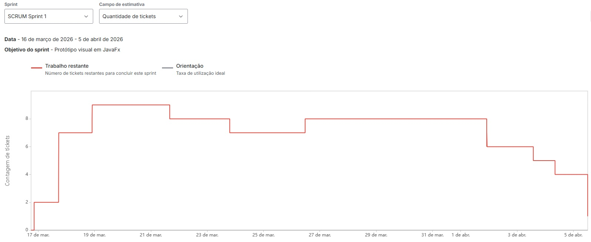

<h1 align="center">
    
</h1>

# Sprint 1

## O que foi feito

Nas sprint 1 focamos em estruturar nossa documentação, estabelecemos processos e para o cliente desenvolvemos wireframes que mostram a ele como planejamos solucionar a dor do mesmo.

**Aqui temos uma pasta com o que foi feito no projeto durante a sprint 1:** 

## Gráfico BurnDown Sprint 1

